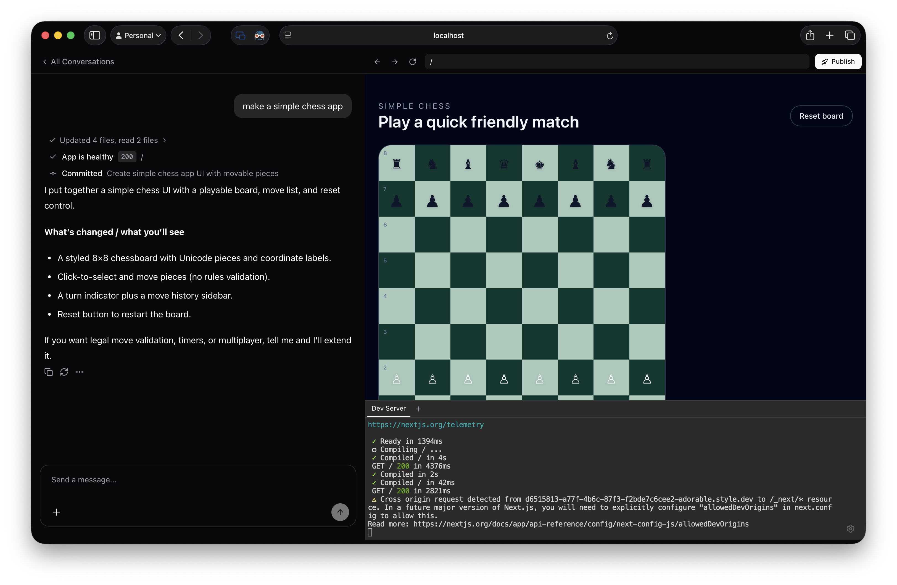

# Adorable



An open-source AI app builder. Describe what you want, and Adorable builds it for you in real time — complete with a live preview, terminal, and one-click publishing.

## Features

- **Conversational app building** — Chat with an AI that writes, edits, and runs code inside a sandboxed VM
- **Live preview & terminal** — See your app update in real time with an embedded browser and terminal
- **One-click publish** — Deploy to a production domain with a single click
- **Persistent projects** — Every project is backed by a git repo; conversations and history are preserved across sessions
- **VM health management** — VMs are automatically checked, restarted, or recreated when you revisit a project

## Tech Stack

- **Framework:** [Next.js](https://nextjs.org) (App Router, TypeScript, Turbopack)
- **AI:** [Vercel AI SDK](https://sdk.vercel.ai) with OpenAI and Anthropic support
- **Chat UI:** [assistant-ui](https://github.com/Yonom/assistant-ui)
- **Sandboxing:** [Freestyle](https://freestyle.sh) cloud VMs with git-backed persistence
- **Styling:** Tailwind CSS + shadcn/ui

## Getting Started

```bash
cd adorable
cp .env.example .env.local  # add your API keys
npm install
npm run dev
```

Open [http://localhost:3000](http://localhost:3000) to start building.

